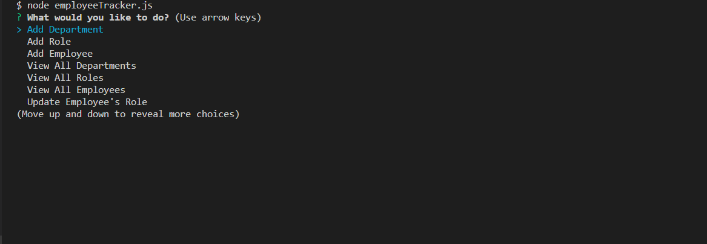

# Employee-Tracker

### Table of Contents
* General Info
* How To Run The Employee Tracker
* Files
* Technologies

### General Info
This is an employee management CIL application.
The user can do the followings:
- View: departments, roles, and employees
- Add: department, role, and employee
- Update: employee's role

### How To Run The Employee Tracker
Install the packages (dependencies) by running the command belowo in the terminal: 
>`npm i` 
Ant then run the command below in the terminal: 
>`node employeeTracker.js`

### Files
* `employeeTracker.js`
* `sqlQueries.js` (under "/lib")
* `htmlRoutes.js` (under "/routes")
* `schema.sql` (under "/db")
* `seed.sql` (under "/db")
* `package.json`
* `package-lock.json`
* `README.md`

### Technologies
Project is created with:
* JavaScript
* Node.js/Express
* MySQL

### Technologies
Packages used:
* mysql
* inquirer
* console.table